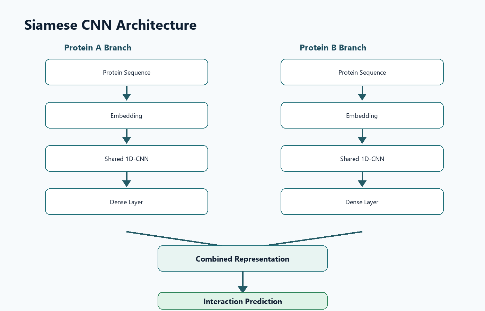
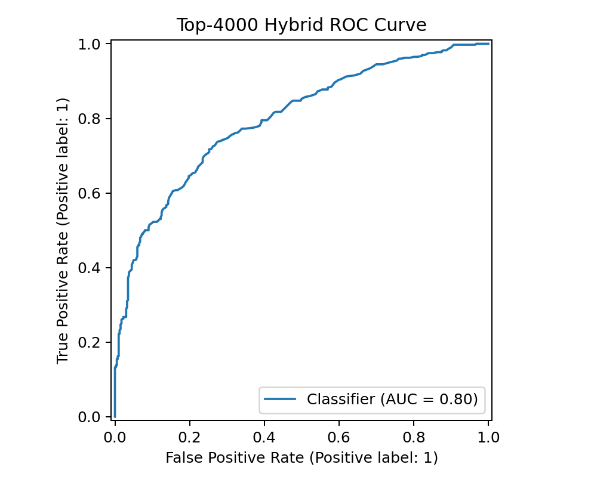
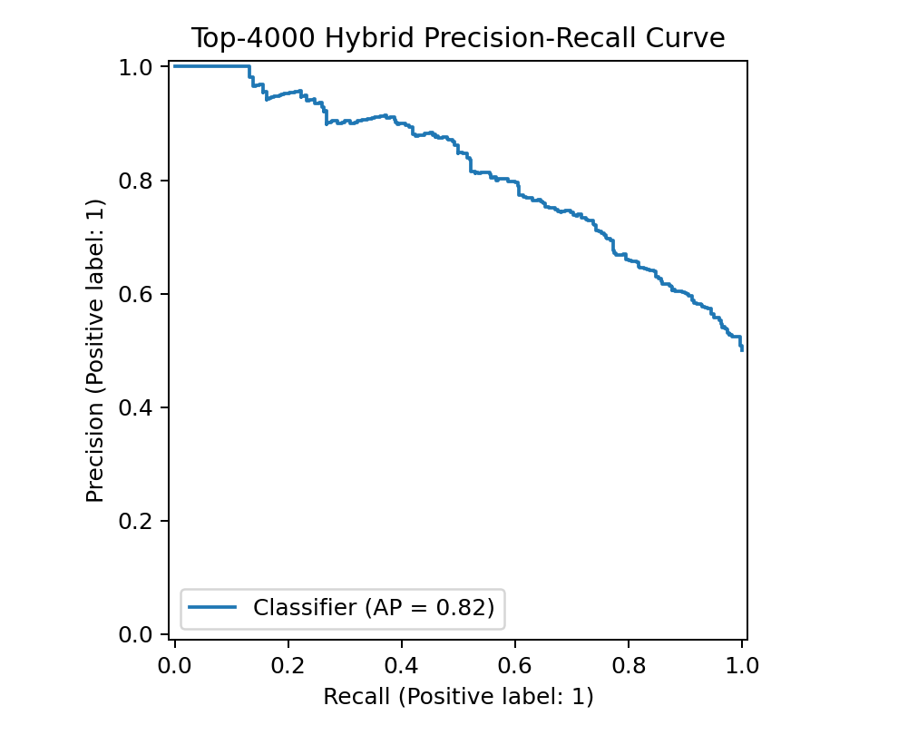
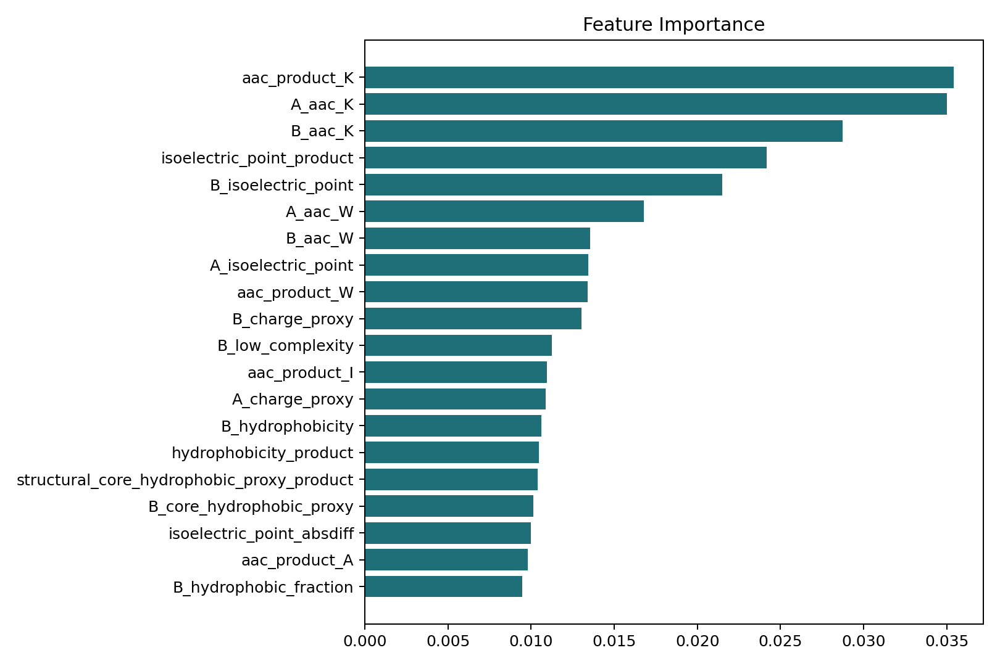

<div align="center">
  
  <h1>IBS-2: DeepTB Protein Interaction Intelligence</h1>
  <p><strong>Structure-Aware Explainable AI for Tuberculosis Drug Target Discovery</strong></p>

  [](https://nextjs.org/)
  [](https://ibs-2.vercel.app/)
  [](https://python.org)
  [](https://tensorflow.org)
</div>

<br/>

> **[🔴 LIVE PLATFORM DEMO (Vercel)](https://ibs-2.vercel.app/)**  
> Explore the 11-page interactive research dashboard showcasing our AI predictions, SHAP explanations, and structural analytics.

---

## 🔬 Project Overview

**DeepTB** is an advanced computational biology platform designed to predict and explain Protein-Protein Interactions (PPIs) within *Mycobacterium tuberculosis* (H37Rv strain). By combining deep learning with structural biology and explainable AI, this project accelerates the discovery of novel drug targets and clarifies mechanisms of drug resistance.

Traditional wet-lab interaction mapping is prohibitively expensive and time-consuming. We solve this by deploying a **Siamese Convolutional Neural Network** augmented with AlphaFold structural contexts, moving beyond "black-box" predictions into biologically actionable insights.

---

## 🛠️ Technology Stack

| Domain | Technologies Used |
| :--- | :--- |
| **Machine Learning Core** | Python, TensorFlow/Keras, Scikit-Learn |
| **Explainable AI (XAI)** | SHAP (SHapley Additive exPlanations), LIME |
| **Computational Biology** | AlphaFold integration, PDB parsing, BioPython |
| **Frontend Platform** | Next.js 14 (App Router), React, TypeScript |
| **UI / Styling** | Tailwind CSS (Glassmorphism), Framer Motion, Lucide |
| **Deployment & Ops** | Vercel (Zero-Runtime Static Generation), Git |

---

## 🧠 Architecture: Siamese CNN

Our approach uses a Siamese neural network architecture. Both proteins in a candidate pair are passed through identical CNN branches with shared weights, processing 128-dimensional residue embeddings before concatenating for classification.



### Key Model Features:
* **170-Dimensional Feature Vectors:** Capturing hydrophobicity, charge, polarity, and dipeptide composition.
* **AlphaFold Fusion:** 3D structural constraints are fused late in the network to eliminate physically impossible (sterically hindered) interactions.
* **Mutation Simulation:** Inject point mutations (e.g., S450L) to simulate interaction disruption.

---

## 📊 Performance Metrics

Evaluated on a strictly balanced holdout dataset of 4,000 *M. tuberculosis* protein pairs.

| Metric | Score | Clinical Relevance |
| :--- | :--- | :--- |
| **ROC-AUC** | **0.798** | High predictive capability across diverse thresholds. |
| **Precision** | **81.32%** | Extremely low false-positive rate (critical for wet-lab validation). |
| **Specificity**| **87.25%** | Accurately identifies non-interacting pairs. |
| **F1 Score** | **0.659** | Balanced performance on positive interactions. |

<div style="display:flex; gap: 10px;">
  
  
</div>

---

## 👁️ Explainable AI (SHAP)

We reject "black-box" predictions. Using SHAP, the platform visualizes exactly *which* amino acid sequences and physicochemical properties drive the interaction score.



---

## 📂 Repository Structure

```text
IBS-2/
├── app/                  # Next.js Frontend App Router (11 pages)
├── components/           # React Components (Sidebar, MoleculeScene)
├── public/               # Static Assets (Zero-Runtime XAI Images & Data)
├── ml_pipeline/          # Python Deep Learning Training Scripts
│   ├── src/              # CNN, Embedding, and SHAP Python files
│   └── data/             # FASTA, XLSX datasets, and metrics CSVs
├── package.json          # Next.js Node Dependencies
└── tailwind.config.ts    # Glassmorphism UI Theme
```

---

## 🚀 Local Development

The Next.js frontend is decoupled from the ML pipeline training to ensure fast, static Vercel deployments.

```bash
# Clone the repository
git clone https://github.com/yuvaakhil8-dev/IBS-2.git
cd IBS-2

# Install frontend dependencies
npm install

# Run the Next.js development server
npm run dev
```

Visit `http://localhost:3000` to view the platform locally.

---
*Developed for computational biology research, scalable AI infrastructure, and drug discovery optimization.*
