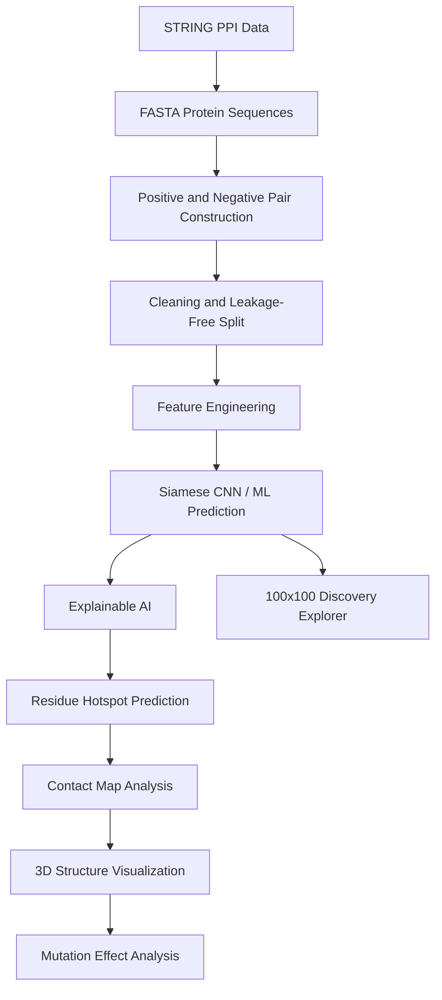

# AI-Driven Explainable Tuberculosis Protein-Protein Interaction Prediction Platform

Research-grade bioinformatics and machine learning platform for predicting **Mycobacterium tuberculosis protein-protein interactions (PPIs)** using sequence features, Siamese CNN-based deep learning, explainable AI, structural analysis, residue hotspot prediction, mutation effect analysis, and interactive visualization.

This project is designed as a complete AI-bioinformatics workflow for **TB protein interaction prediction and structural interpretation**.

## Key Features

- Tuberculosis-specific protein-protein interaction prediction
- STRING database and FASTA sequence based dataset construction
- Balanced positive/negative PPI dataset
- 170-dimensional engineered protein-pair feature vectors
- Siamese CNN and classical ML model comparison
- Explainable AI using SHAP/LIME-style feature interpretation
- Residue-level hotspot and interface prediction
- Contact map analysis
- AlphaFold/PDB-aware 3D structure visualization
- Mutation effect analysis for biological interpretation
- 100x100 interaction discovery explorer
- Streamlit research dashboard
- FastAPI + React next-generation platform scaffold
- Editable PowerPoint presentation and research reports

## Project Title

**AI-Driven Explainable Tuberculosis Protein-Protein Interaction Prediction and Structural Analysis Platform**

## Dataset Overview

| Item | Value |
| --- | ---: |
| Organism | *Mycobacterium tuberculosis* H37Rv |
| Interaction source | STRING database |
| Raw proteins | 4,026 |
| Raw interaction records | 693,013 |
| Final balanced pairs | 4,000 |
| Positive pairs | 2,000 |
| Negative pairs | 2,000 |
| Feature dimensions | 170 |
| Train samples | 2,800 |
| Validation samples | 400 |
| Test samples | 800 |

The dataset uses leakage-aware splitting to avoid the same proteins appearing across train/test partitions.

| Leakage Check | Value |
| --- | ---: |
| Train-validation protein overlap | 0 |
| Train-test protein overlap | 0 |
| Validation-test protein overlap | 0 |

## Model Performance

| Metric | Value |
| --- | ---: |
| Accuracy | 0.71375 |
| Precision | 0.81319 |
| Recall | 0.55500 |
| F1-score | 0.65973 |
| MCC | 0.45083 |
| ROC-AUC | 0.79838 |
| PR-AUC | 0.81599 |
| Specificity | 0.87250 |

## System Workflow



## Major Modules

```text
IBS_project/
  deeptb/
    data/              Dataset loading, pair generation, structure retrieval
    features/          Sequence, structural, contact-map, embedding features
    models/            ML, Siamese CNN, transformer runtime, ensemble code
    training/          Training and output generation scripts
    evaluation/        Metrics, ROC/PR, publication outputs
    explainability/    Feature contribution and residue importance
    biology/           Interface residues, mutation, drug target logic
    visualization/     Plots, heatmaps, structure viewers
    dashboard/         Streamlit dashboard
  datasets/            Processed and research datasets
  final_Project/       Final reports, graphs, and artifacts
  flexible_batch_analysis/
  flexible_dashboard/
  flexible_visualizations/
  nextgen_ppi_platform/
  presentation/
  reports/
  visualizations/
```

## Core Capabilities

### 1. Protein Interaction Prediction

The system predicts whether two TB proteins are likely to interact and reports:

- Interaction probability
- Confidence score
- Binary interaction label
- Feature-based biological explanation
- Ranked candidate interactions

### 2. Explainable AI

The project includes:

- SHAP/LIME-style feature importance
- Residue contribution mapping
- Feature ranking plots
- Biological explanation summaries

### 3. Structural Biology Analysis

Structural support includes:

- AlphaFold/PDB structure retrieval support
- Contact map generation
- Residue contact density
- 3D protein visualization
- Interface residue highlighting

| Structure Item | Value |
| --- | ---: |
| UniProt mapped proteins | 92 |
| AlphaFold structures available | 91 |
| Pairs with both structures | 149 |

### 4. Mutation Effect Analysis

The mutation module supports mutation inputs such as:

```text
S450L
```

Outputs include:

- Original interaction probability
- Mutated interaction probability
- Probability delta
- Interface disruption score
- Gain/loss/neutral effect label

### 5. 100x100 Discovery Explorer

The flexible analysis engine supports up to:

| Setting | Value |
| --- | ---: |
| Protein A set size | 100 |
| Protein B set size | 100 |
| Maximum comparisons | 10,000 |

Outputs include interaction heatmaps, ranked interactions, strongest predicted non-interactions, and CSV exports.

## Installation

```bash
git clone <your-repository-url>
cd IBS_project
python -m venv .venv
```

Windows:

```powershell
.\.venv\Scripts\activate
pip install -r requirements_deeptb.txt
```

Linux/macOS:

```bash
source .venv/bin/activate
pip install -r requirements_deeptb.txt
```

## Run the Streamlit Dashboard

```powershell
streamlit run deeptb/dashboard/streamlit_app.py --server.port 8507 --server.address 127.0.0.1
```

Open:

```text
http://127.0.0.1:8507
```

## Run the Pipeline

Fast smoke run:

```powershell
python -m deeptb.cli all --fast --pairs-per-class 20
```

Full dataset run:

```powershell
python -m deeptb.cli all --pairs-per-class 2000
```

## Next-Generation API Layer

The repository also includes a FastAPI + React scaffold under:

```text
nextgen_ppi_platform/
```

Run FastAPI:

```powershell
cd nextgen_ppi_platform/backend
python -m uvicorn app.main:app --host 127.0.0.1 --port 8000 --reload
```

API docs:

```text
http://127.0.0.1:8000/docs
```

## Important Outputs

| Output | Path |
| --- | --- |
| Dataset report | `datasets/research_top4000/top4000_dataset_report.json` |
| Feature matrix | `datasets/research_top4000/top4000_feature_matrix.csv` |
| Feature importance | `explainability/feature_importance.csv` |
| Discovery results | `outputs/discovery_100x100/` |
| Research report | `reports/CURRENT_PROJECT_PROGRESS_REPORT_2026_05_20.md` |
| Presentation | `presentation/generated/TB_PPI_Explainable_AI_Siamese_CNN_20_Slides_Editable.pptx` |

## Research Significance

This project goes beyond simple PPI classification by connecting:

- Prediction
- Explainability
- Residue-level biological interpretation
- Structural visualization
- Mutation effect analysis
- Large-scale interaction discovery

It can be presented as a **structure-aware explainable tuberculosis protein interaction intelligence platform**.

## Future Work

- Full ProtBERT/ESM fine-tuning
- Graph Neural Network link prediction
- AlphaFold-Multimer or docking-style complex modeling
- Drug target prioritization against external TB databases
- Clinical mutation dataset integration
- Cloud deployment with FastAPI, React, and PostgreSQL

